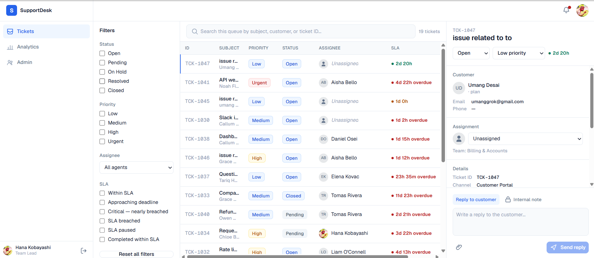
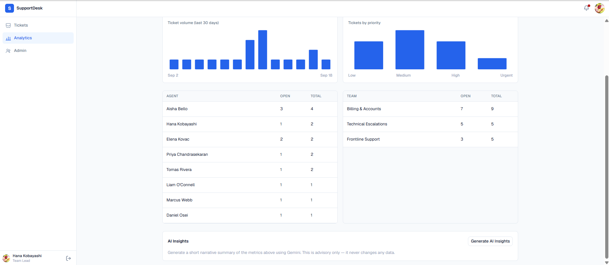
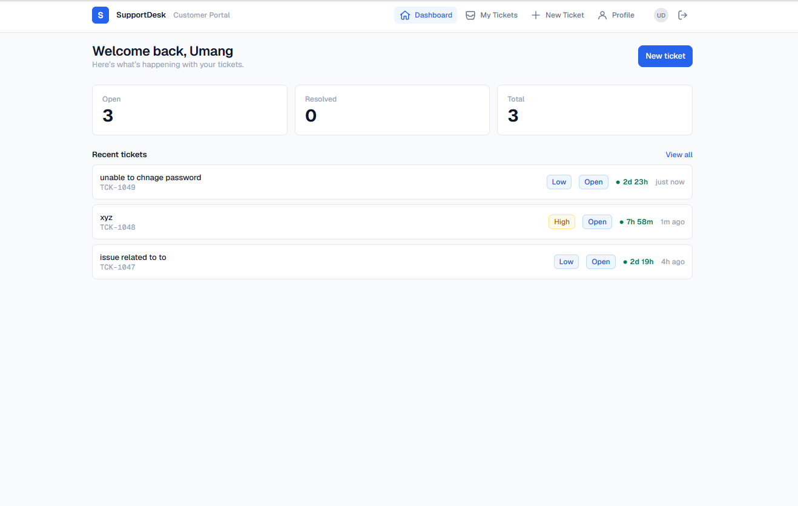
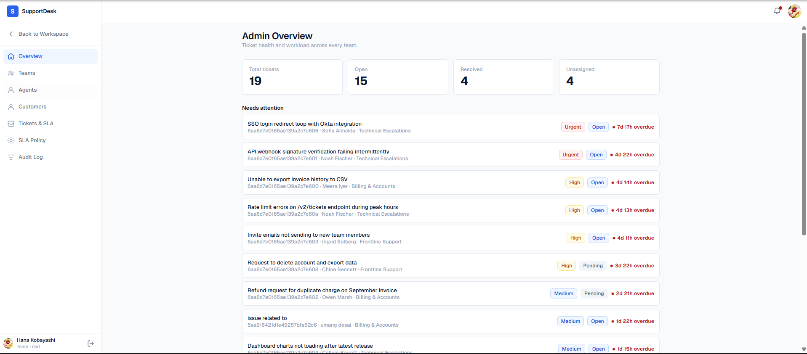
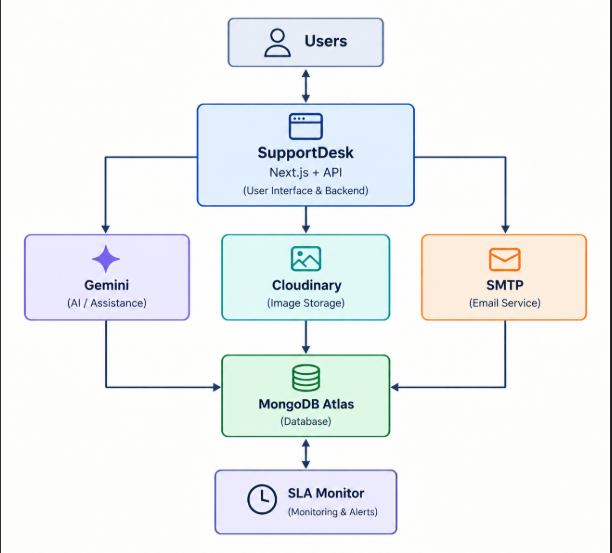

# SupportDesk

SupportDesk is a full-stack customer support ticketing platform built with Next.js and MongoDB.

The platform provides a complete support workflow for both customers and support teams, including ticket management, SLA tracking, realtime updates, AI-assisted support tools, role-based administration, email notifications, and file uploads.

Built as a single Next.js application, SupportDesk combines frontend, backend, authentication, database operations, and third-party integrations into one deployable project.

## Live Demo

Live Application: https://supportdesk-seven.vercel.app

## Features

-Ticket creation and management
-Team-based ticket assignment
-SLA monitoring and deadline tracking
-Realtime updates using Server-Sent Events (SSE)
-Customer self-service portal
-Role-based access control
-Admin dashboard for users, teams, and SLA policies
-Audit logging for sensitive actions
-AI-powered ticket summaries, suggestions, and reply drafts using Gemini
-Email notifications and password reset flows
-Cloudinary-powered file uploads and avatar management
-Secure session-based authentication
-Rate limiting and account security controls

## Screenshots

### Agent Workspace

### AI Assistant

### Customer Portal

### Admin Dashboard

## Architecture

## Tech Stack

### Frontend

-React 19
-Next.js 16
-Tailwind CSS v4

### Backend

-Next.js Route Handlers
-Node.js Runtime
-MongoDB
-Mongoose

### Integrations

-Google Gemini API
-Cloudinary
-Nodemailer
-SMTP Email Service

### Deployment

-Vercel
-MongoDB Atlas

## About This Project

SupportDesk was built as a full-stack project to explore realtime systems, role-based access control, AI integrations, and customer support workflows within a single Next.js application.

The project is fully deployed and operational on Vercel.